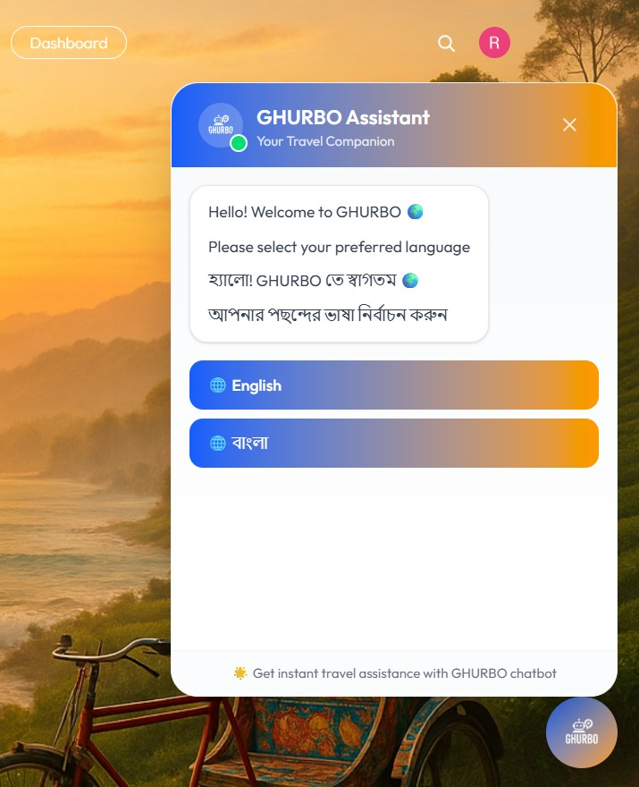

  

<h1 align="center">GHURBO — Smart Tour Package Platform for Bangladesh</h1>

  <a href="https://ghurbotravel.vercel.app/" target="_blank"><b>🌐 Visit Live Website</b></a>

<h2 align="center">
  Course: CSE 299 Junior Design · Section 4 · Semester: Summer 2025  
  Faculty: Mohammad Shifat-E-Rabbi
</h2>

<h3 align="center">
  Md Nafees Ahommed — ID: 2111934642   Md Rokib Hasan Oli — ID: 2211950642   Md Rakibul Hasan — ID: 2212346042 
  Date Prepared: August 2025
</h3>

---

## 📑 Table of Contents
1. [Introduction](#introduction)
2. [Features](#features)
3. [Technology Stack](#technology-stack)
4. [Business Plan / Monetization](#business-plan--monetization)
5. [Project Screenshots](#project-screenshots)
   - [Gallery View](#gallery-view)
   - [Home Page](#home-page)
   - [Tour Packages](#tour-packages)
   - [Package Details & Booking](#package-details--booking)
   - [Check Availability](#check-availability)
   - [Book Now](#book-now)
   - [My Bookings](#my-bookings)
   - [Dashboard (Package Owner)](#dashboard-package-owner)
   - [Package Listings](#package-listings)
   - [Add Package](#add-package)
   - [Package Registration Form](#package-registration-form)
   - [AI Chatbot](#ai-chatbot)
   - [Email Verification](#email-verification)
   - [Booking Confirmation Email](#booking-confirmation-email)
   - [Experience Page](#experience-page)
   - [About Page](#about-page)
6. [Conclusion](#conclusion)

---

## 1. Introduction
GHURBO is a **full-stack travel platform** built for Bangladesh. Travelers can discover curated tour packages, compare options, chat with an AI assistant, and book securely — while tour providers manage listings, pricing, and bookings through a dedicated dashboard.

[▲ Back to top](#-table-of-contents)

---

## 2. Features
- **🎯 Curated Packages** — Filter by destination, budget, and dates with live availability.
- **💎 Exclusive Offers** — Seasonal discounts and special deals.
- **🤖 AI Assistant** — English & Bangla chatbot for instant help and recommendations.
- **📊 Provider Dashboard** — Manage packages, bookings, and visibility.
- **🔒 Secure Booking & Emails** — Reliable confirmations and receipts.
- **📱 Responsive UI** — Mobile-first, modern interface.

[▲ Back to top](#-table-of-contents)

---

## 3. Technology Stack
<!-- Clickable logos + names in a neat responsive grid -->

  <table>
    <tr>
      <td align="center" width="120">
        <a href="https://react.dev/" target="_blank">
           React
        </a>
      </td>
      <td align="center" width="120">
        <a href="https://vitejs.dev/" target="_blank">
           Vite
        </a>
      </td>
      <td align="center" width="120">
        <a href="https://tailwindcss.com/" target="_blank">
           Tailwind CSS
        </a>
      </td>
      <td align="center" width="120">
        <a href="https://reactrouter.com/" target="_blank">
           React Router
        </a>
      </td>
      <td align="center" width="120">
        <a href="https://nodejs.org/" target="_blank">
           Node.js
        </a>
      </td>
      <td align="center" width="120">
        <a href="https://expressjs.com/" target="_blank">
           Express
        </a>
      </td>
    </tr>
    <tr>
      <td align="center" width="120">
        <a href="https://www.mongodb.com/" target="_blank">
           MongoDB
        </a>
      </td>
      <td align="center" width="120">
        <a href="https://clerk.com/" target="_blank">
           Clerk
        </a>
      </td>
      <td align="center" width="120">
        <a href="https://cloudinary.com/" target="_blank">
           Cloudinary
        </a>
      </td>
      <td align="center" width="120">
        <a href="https://nodemailer.com/" target="_blank">
           Nodemailer
        </a>
      </td>
      <td align="center" width="120">
        <a href="https://www.brevo.com/" target="_blank">
           Brevo
        </a>
      </td>
      <td align="center" width="120">
        <a href="https://vercel.com/" target="_blank">
           Vercel
        </a>
      </td>
    </tr>
  </table>

[▲ Back to top](#-table-of-contents)

---

## 4. Business Plan / Monetization
- Partner listings (hotels, guides, experiences)
- Premium package promotions
- Service fees per booking
- Subscription plans for tour providers

[▲ Back to top](#-table-of-contents)

---

## 5. Project Screenshots

### Gallery View
<!-- Clean, responsive horizontal gallery (works on GitHub) -->

  <h4>🖼️ Complete Application Showcase</h4>
  <em>Swipe or scroll to explore all features</em>

 

  <table>
    <tr>
      <td align="center">
        
         <strong>Home Page</strong>
      </td>
      <td align="center">
        
         <strong>Tour Packages</strong>
      </td>
      <td align="center">
        
         <strong>Package Details</strong>
      </td>
    </tr>
    <tr>
      <td align="center">
        
         <strong>Check Availability</strong>
      </td>
      <td align="center">
        
         <strong>Book Now</strong>
      </td>
      <td align="center">
        
         <strong>My Bookings</strong>
      </td>
    </tr>
    <tr>
      <td align="center">
        
         <strong>Provider Dashboard</strong>
      </td>
      <td align="center">
        
         <strong>Package Listings</strong>
      </td>
      <td align="center">
        
         <strong>Add Package</strong>
      </td>
    </tr>
    <tr>
      <td align="center">
        
         <strong>Package Registration</strong>
      </td>
      <td align="center">
        
         <strong>AI Chatbot</strong>
      </td>
      <td align="center">
        
         <strong>Email Verification</strong>
      </td>
    </tr>
    <tr>
      <td align="center">
        
         <strong>Booking Confirmation</strong>
      </td>
      <td align="center">
        
         <strong>Experience Page</strong>
      </td>
      <td align="center">
        
         <strong>About Page</strong>
      </td>
    </tr>
  </table>

[▲ Back to top](#-table-of-contents)

### Home Page

### Tour Packages

### Package Details & Booking

### Check Availability

### Book Now

### My Bookings

### Dashboard (Package Owner)

### Package Listings

### Add Package

### Package Registration Form

### AI Chatbot

### Email Verification

### Booking Confirmation Email

### Experience Page

### About Page

[▲ Back to top](#-table-of-contents)

---

## 6. Conclusion
GHURBO is built for **real travelers and local providers** — combining curated experiences, modern UX, AI assistance, and secure booking. The stack and design choices make it **scalable and production-ready**.

---
