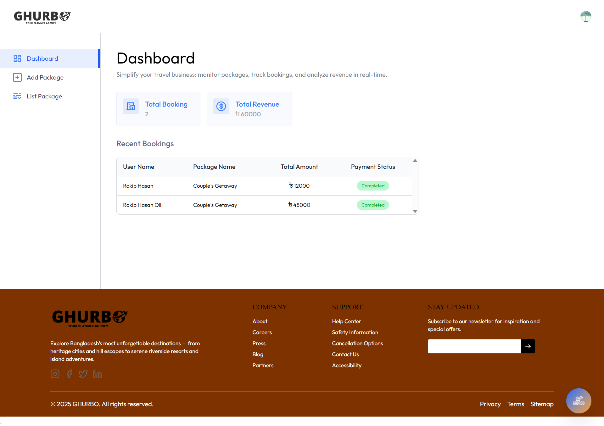
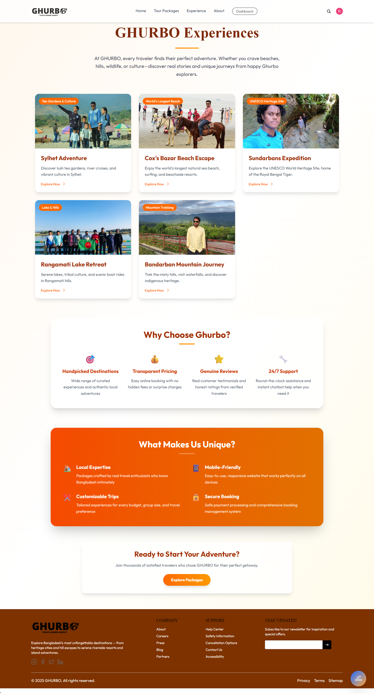
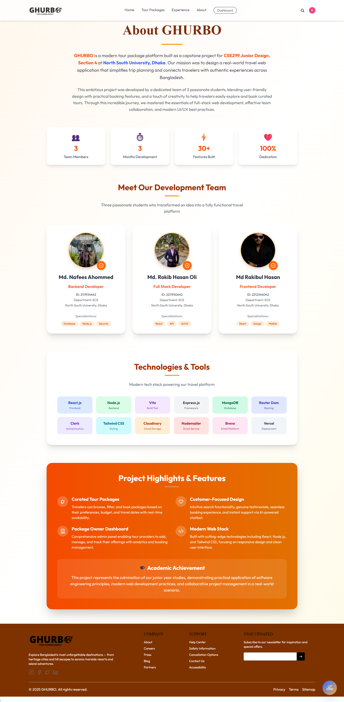

 
  

   

<h1 align="center">GHURBO – Smart Tour Package Platform for Bangladesh</h1>

  <a href="https://ghurbotravel.vercel.app/" target="_blank">
    🌐 Visit Our Live Website
  </a>

<h2 align="center">
Course: CSE 299 Junior Design  
Section: 4  
Semester: Summer 2025   
Faculty: Mohammad Shifat-E-Rabbi
</h2>

<h3 align="center">
Student Name: Md Nafees Ahommed – ID: 2111934642  
Student Name: Md Rokib Hasan Oli – ID: 2211950642  
Student Name: Md Rakibul Hasan – ID: 2212346042  
Date Prepared: August 2025
</h3>

---

## 📑 Table of Contents
1. [Introduction](#introduction)  
2. [Features](#features)  
3. [Technology Stack](#technology-stack)  
4. [Business Plan / Monetization](#business-plan--monetization)  
5. [Project Screenshots](#project-screenshots)  
   - [Home Page](#home-page)  
   - [Tour Packages](#tour-packages)  
   - [Package Details & Booking](#package-details--booking)  
   - [Check Availability](#check-availability)  
   - [Book Now](#book-now)  
   - [My Bookings](#my-bookings)  
   - [Dashboard (Package Owner)](#dashboard-package-owner)  
   - [Package Listings](#package-listings)  
   - [Add Package](#add-package)  
   - [Package Registration Form](#package-registration-form)  
   - [AI Chatbot](#ai-chatbot)  
   - [Email Verification](#email-verification)  
   - [Booking Confirmation Email](#booking-confirmation-email)  
   - [Experience Page](#experience-page)  
   - [About Page](#about-page)  
6. [Conclusion](#conclusion)  

---

## 1. Introduction
GHURBO is a **full-stack travel platform** built for Bangladesh. It allows travelers to explore curated tour packages, book trips securely, and interact with an AI-powered travel assistant. The platform bridges travelers with tour providers, hotels, and guides, offering a seamless booking experience.

---

## 2. Features
- **🎯 Curated Tour Packages** – Filter by budget, location, and travel dates.  
- **💎 Exclusive Offers** – Special discounts and seasonal promotions.  
- **🤖 AI Travel Assistant** – Multi-language chatbot for instant help.  
- **📊 Package Owner Dashboard** – Manage packages, bookings, and analytics.  
- **🔒 Secure Booking & Payments** – Reliable transactions with email confirmations.  
- **📱 Mobile-Friendly Design** – Works smoothly on all devices.  

---

## 3. Technology Stack
**Frontend:** React.js, Vite, Tailwind CSS, React Router Dom  
**Backend:** Node.js, Express.js, MongoDB  
**Authentication & Tools:** Clerk, Cloudinary, Nodemailer, Brevo, Vercel Deployment  

---

## 4. Business Plan / Monetization
GHURBO starts as a free platform to build trust and user base. Monetization channels include:
- Partner listings (hotels, guides, experiences)  
- Premium package promotions  
- Service fees per booking  
- Subscription plans for tour providers  

---

## 5. Project Screenshots

### Home Page

### Tour Packages

### Package Details & Booking

### Check Availability

### Book Now

### My Bookings

### Dashboard (Package Owner)

### Package Listings

### Add Package

### Package Registration Form

### AI Chatbot

### Email Verification

### Booking Confirmation Email

### Experience Page

### About Page

---

## 6. Conclusion
GHURBO is more than just a project – it’s a functional travel platform tailored to **Bangladesh’s tourism industry**. With AI assistance, curated packages, and secure booking, it provides value to both travelers and tour providers. The clean design, robust backend, and scalability make it ready for real-world deployment.

---
